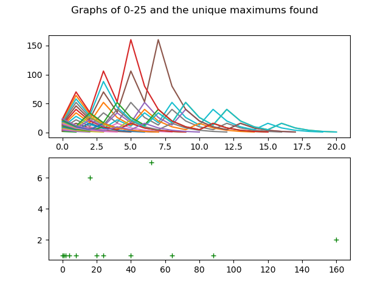
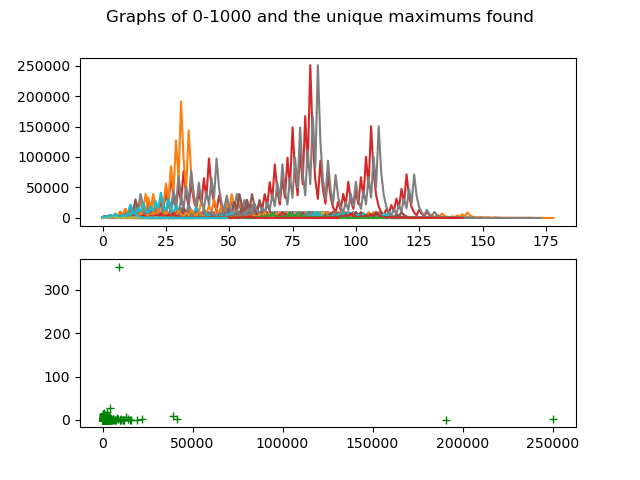
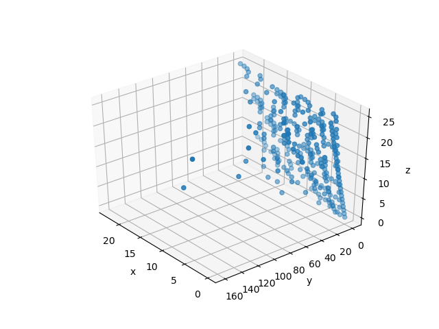
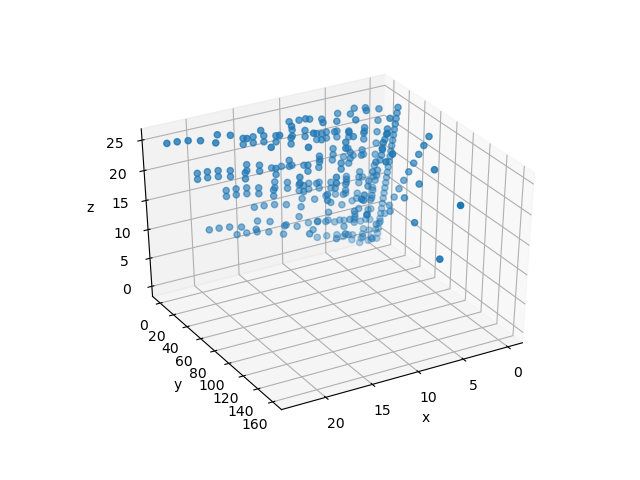
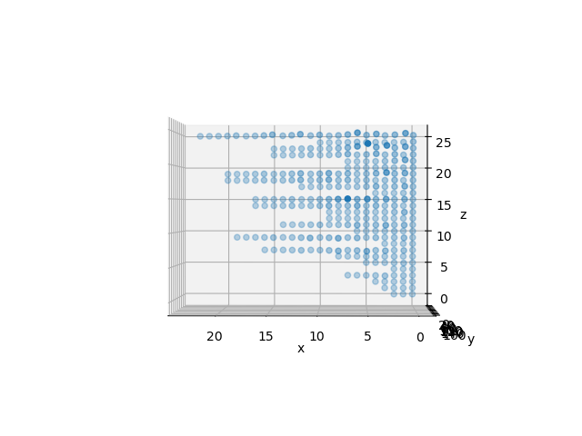
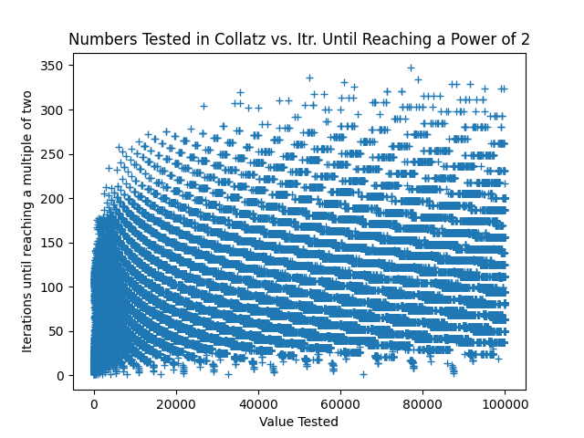

The basic function of this gives a 3D view of multiple numbers subjected to the Collatz conjecture. If the user doesn't already know what the Collatz conjecture is, the 3D graph will make essentially no sense.

(It is perhaps most instructive to rotate the 3D view to view the 'Bounce Indices' along the horizontal ("x") axis, and the 'Starting Number' along the vertical ("y") axis. This will allow the user to simply view the length of the 'lists' (explained below) generated from a given starting number)

Now assuming the user knows about the Collatz conjecture, the 3D graph will still appear excruciating at first. 
The axis of 'Starting Number' will (relative to the input bounds) show the number used on its line. For example, if the bounds given were -10 to 10, the index of 0 would be -10, 1 would be -9, etc.
The axis of  'Bounce Indices' simply shows the length of "Collatz Conjecturing" that happens to the starting number. I.e. the 'list' for the starting number of 3 in the Collatz Conjecture is:
[3, 10, 5, 16, 8, 4, 2, 1]
This list of "bounces" has 8 values and therefore 8 indicies. So, one would expect to find 8 points along the line for a starting value of 3.
The axis of 'Bounce Value' simply refers to an individual number in this list. Plotting this is more interesting than anything due to the patterns and 'mountains' created.

EnchancedNumberTester is the driving function that tests for repeating lists and executes the proper algorithm if the current number is even/odd. I.e. divide by 2 if even or multiply by 3 and add 1 if the number is odd. It will constantly preform this process until it detects any of the repeat values. For positive numbers this is the typical 8,4,2,1 pattern, and for negatives there are many more (reference the repeat test function).

None of this is supposed to act as any sort of proof of any patterns for the Collatz conjecture, but the deceptive simple nature of the problem makes it intresting to at least attmept to research. Below are some pictures of graphs created for various parts:

Ia - Series for starting values 0-25 and the counts of the unique maximums

Ib - Series for starting values 0-1000 and the counts of the unique maximums

II - 3D Plot of the 0-25 series
- Z axis: Starting value
- Y axis: Running value in series
- X axis: Position/Index in a series

III - Interesting Pattern

One worthwhile pattern I found (that I haven't seen otherwise online) comes from recording an initial starting value of a series versus the number of iterations it took until that starting value became a power of two (and therefor would shortly reach one and would stop). Unexpectedly, there are some very clear curves and patterns that came out of this:

